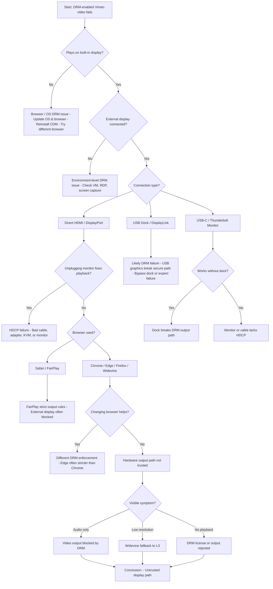

# Video does not play

Course videos are served by the third party video streaming platform [Vimeo](https://vimeo.com/), and some of these are DRM (digital rights management) protected to prevent unauthorized copying. Some students report that the these videos do not play on their system and the likely causes for this are discussed below.

TLDR; Jump to [problem determination flowchart](#problem-determination-flowchart), although some items on the chart may not make complete sense until you read the rest of the document.

## What “DRM” Means for Embedded Video

When video is embedded (HTML5 `<video>`, `<iframe>`, or a player like Shaka / Video.js), DRM controls:

* Who can decrypt the video
* Where decrypted pixels are allowed to go
* What resolution / features are permitted
* Whether the OS considers the playback path “secure”

Most commercial streaming platforms rely on Encrypted Media Extensions (EME) in the browser plus a Content Decryption Module (CDM) supplied by the OS or browser.

## DRM used by Vimeo

Vimeo uses systems called Widevine created by Google for most browsers and operating systems, and FairPlay created by Apple for Safari, iOS and macOS.

### Widevine

Widevine has a system of "levels" which control the output quality of the video. If you have playback but cannot select 1080p, then it means that Widevine has pinned you to L3 for some decision it has made on your computer's configuration.

| Level | What it means             | Practical Effect                      |
|-------|---------------------------|---------------------------------------|
| L1    | Full hardware backed DRM  | 4K/HRD allowed, strict output control |
| L2    | Partial hardware security | Rarely used                           |
| L3    | Software-only DRM         | Usually limited to 480p-720p          |

### Fairplay

* Requires Apple-controlled hardware/software stack
* External displays often must support HDCP
* Screen capture almost always blocked

## DRM Related Settings

### Output Protection / Secure Output Path

Controls **where video frames are allowed to be displayed**

* Requires:
    * Hardware video decoder
    * Trusted GPU driver
    * HDCP-capable output (HDMI/DP)
* If broken:
    * Playback error
    * Black screen
    * Forced downgrade (e.g., 480p)

### Resolution / Quality Restrictions

Content licenses may specify:
* Max resolution per DRM level
* HDR allowed only on trusted paths
* High frame rate (60fps) restricted

Example:
> 4K allowed only on Widevine L1 + HDCP 2.2

### Screen Capture & Recording Control

DRM may:
* Disable OS-level screen capture
* Return black frames to capture APIs
* Detect known recording tools

This applies even if you’re not recording but the system *could*.

## How Hardware Configurations Affect Playback

This is where most "why doesn’t this video play?" issues arise.

### Secondary Monitors (HDMI / DisplayPort)

Generally safe IF:
* Monitor supports HDCP 1.4 or 2.2
* Connected directly to GPU
* No signal converters in between

Common failure cases:
* Old monitors without HDCP
* Passive HDMI splitters
* KVM switches

Symptoms:
* Playback error
* Black video, audio works
* Forced low resolution

### USB Docking Stations (DisplayLink, USB-C docks)

⚠ Very common DRM failure point

Why?

Many USB docks:
* Do not pass raw GPU output
* Use software frame buffers
* Appear as a “virtual display adapter”

From a DRM perspective:

> Decrypted pixels are leaving the secure GPU path

Result:
* Widevine L1 → L3 downgrade
* Playback blocked entirely

Even expensive enterprise docks can fail DRM checks.

### USB-C / Thunderbolt Displays

Works if:
* Display uses **DisplayPort Alt Mode**
* GPU drives the panel directly
* HDCP supported end-to-end

Fails if:
* Dock re-encodes video
* Display is tunnelled through USB graphics

### Virtual Machines & Remote Desktops

Almost always restricted.
* VM GPUs often lack trusted DRM paths
* RDP creates a virtual display
* Citrix / VDI environments usually blocked

Typical behavior
* DRM error
* Player loads but video never starts
* Audio-only playback

### Screen Recording / Streaming Software

Even *inactive* software can matter.

Examples:
* OBS installed but not recording
* Virtual camera drivers
* Accessibility screen readers

Some DRM systems detect:

* Hooked graphics APIs
* Capture-capable drivers

## Problem determination flowchart

