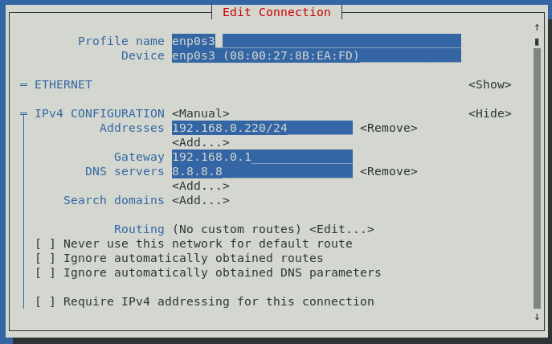

# How-To: Networking on CentOS 7

Applies to:

* Ansible for the Absolute Beginners ([KodeKloud](https://kodekloud.com/courses/ansible-for-the-absolute-beginners-course/), [Udemy](https://www.udemy.com/course/learn-ansible/))

# Important

VirtualBox does not currently work correctly on Apple M1/M2 computers. We wait for Oracle who make VirtualBox to create a stable release.

This will only work for Intel Mac laptops.

# Outline

This guide will show you how to get networking functioning correctly on CentOS 7 desktop image from oxboxes that is used in the above courses. It is supplemental to the install instructions given in the courses. If you cannot connect to the VM using SHH (MobaXterm etc), or if the VM cannot reach the Internet, then this guide is for you!

The assumption is that you have installed the image in VirtualBox, started it and logged into it, however it cannot connect to the internet and/or you cannot connect to it using an SSH client like MobaXterm, most likely due to the primary adapter `enps03` not having an IP address.

Credentials to log into osboxes virtual machines are as follows. Note that for any `sudo` command, it will ask for this password.

* Username: `oxboxes`
* Password: `osboxes.org`

# Network Adapter Configuration

If the VM cannot connect to the Internet, this section will fix that. We will assume that you have correctly configured the network adapter as `Bridged` as shown in the course video. What we are doing here is configuring a static IP address for the network adapter inside the VM.

1. Determine your network gateway. Note that the gateway on a home network is usually your broadband router.
    1. For Windows users:
        1. Open a command prompt and enter the command `route print 0.0.0.0`
        1. Examine the output which will look something like this. I am only showing the *relevant* part of all the output

            ```
            IPv4 Route Table
            ===========================================================================
            Active Routes:
            Network Destination        Netmask          Gateway       Interface  Metric
                      0.0.0.0          0.0.0.0      192.168.0.1    192.168.0.111     25
            ```

            The piece of information required here is the `Gateway` which in this example is `192.168.0.1` but on your machine it might be different. Keep this for later. Note that `Interface` is the IP address of the computer you ran the `route print` command from, i.e. the IP of your laptop or workstation.

    1. For Intel Mac users
        1. Open a terminal and enter the command `route get default | grep gateway`
        1. Examine the output which should look like this

            ```
            gateway: 192.168.0.1
            ```

            In this example is `192.168.0.1` but on your machine it might be different. Keep this for later.

    1. The first 3 numbers in the gateway address is your `network address`. We will use that information when choosing an IP address for the VM later.

1. Choose an IP address on your network that is not already in use by something else (your laptop, any other devices connected to the router or via WiFi).</br></br>**IMPORTANT** If you "clone" a VM, you will have choose a different IP for each clone you create, and configure the clone as per the remaining instructions below. If you are going to be making clones, pick as many unique IP addresses as you're going to need to bring up all VMs requested by the course.
    1. For Windows users:
        1. Open a command prompt and enter the command `arp -a`.
        1. Several lists are printed. Find the list that is for your laptop adapter (has the `Interface` IP found in the route table above). It looks like this, and is showing the IP of all devices currently connected to your network in the `Internet Address` column. Choose an IP not in this list, e.g. `192.168.0.220`. Be sure to use *your* network address which may or may not be `192.168.0.`, so it is the last number you need to choose. The first 3 must be the same.

        ```
        Interface: 192.168.0.111 --- 0x16
        Internet Address      Physical Address      Type
        192.168.0.1         00-e0-b6-15-fc-3a     dynamic
        192.168.0.2         88-ae-dd-04-f2-e1     dynamic
        192.168.0.6         00-15-5d-ac-37-08     dynamic
        192.168.0.13        00-15-5d-ac-37-0a     dynamic
        ```
    1.  For Intel Mac users
        1. Open a terminal and enter the command `arp -a`.
        1. It looks like this, and is showing the IP of all devices currently connected to your network in brackets. Choose an IP not in this list, e.g. `192.168.0.220`. Be sure to use *your* network address which may or may not be `192.168.0.`, so it is the last number you need to choose. The first 3 must be the same.

            ```
            ? (192.168.0.12) at a4:ca:a0:32:ff:f3 on eno ifscope [ethernet]
            ? (192.168.0.24) at 4a:39:17:86:4f:53 on eno ifscope [ethernet]
            ```


1. Power on the VM if it is not already and log in.
1. Open the Terminal application (Click `Applications` at top left of desktop, select `System Tools`, then `Terminal` )
1. Enter the command `sudo nmtui`.</br>This will bring up the following. In this application, use cursor keys to navigate the controls and ENTER to select/press buttons. `Edit a connection` is already selected, so hit ENTER.</br>
1. `enps03` should already be selected. If not, select it first then hit ENTER.</br>
1. Now you have the `Edit Connection` dialog.<br/></br>
    1. Set `IPv4 CONFIGURATION` to `Manual`, then hit `<Show>`
    1. In `Addresses`, hit `<Add>`. Set the IP you chose in step 2 and put `/24` after it.
    1. In `Gateway` set the gateway address you found in step 1
    1. In `DNS servers`, hit `Add`. Put `8.8.8.8` in the box that appears. IT should now be looking something like this</br></br>
    1. Down arrow until you reach the checkbox `Automatically connect`. Hit space bar in the checkbox to make it to `[X]`.
    1. Down-arrow till you reach the end of the dialog box and hit ENTER on `<OK>`. This will return you to the previous dialog.
    1. Hit ESC a couple of times until the application closes
1.  Restart the VM by entering `reboot` at the terminal prompt
1.  Log back in and run firefox from the Applications menu. It should now be able to browse.


# SSH configuration

If you got the above network configuration working, then the VM should now be listening on SSH port 22 on the IP address you assigned to it (which will be e.g. `192.168.0.220` depending on what you chose in step 2). The MobaXterm instructions given in the course video should now work provided you use the correct IP address and have followed the other instructions correctly.


