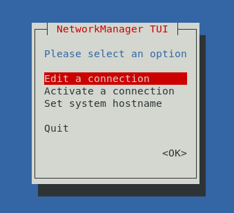
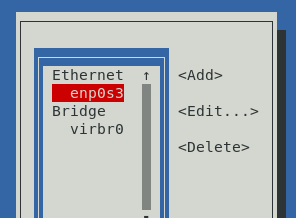
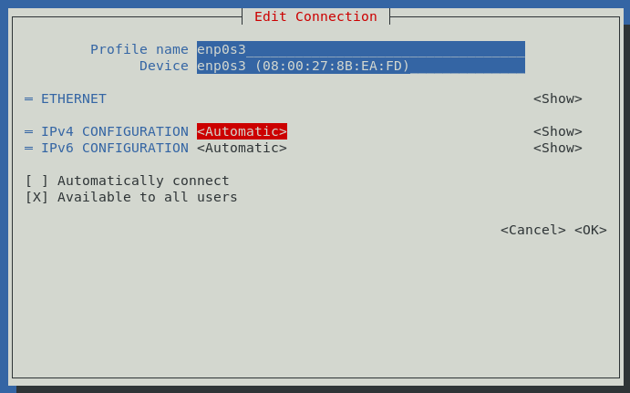
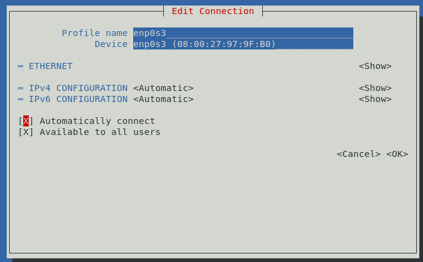

# How-To: Networking on CentOS 7

Applies to:

* Ansible for the Absolute Beginners ([KodeKloud](https://kodekloud.com/courses/ansible-for-the-absolute-beginners-course/), [Udemy](https://www.udemy.com/course/learn-ansible/))
* DevOps Pre-Requisite Course ([KodeKloud](https://kodekloud.com/courses/devops-pre-requisite-course/))


**Update** - I've now tested this on CentOS 9 image from oxboxes. The following steps also work for this, so by definition will work for CentOS 8 too. In CentOS 9, you'll find the terminal app from `Activities` at the top left, then click its icon at the bottom of the screen.

# Important

VirtualBox does not currently work correctly on Apple M1/M2 computers. We wait for Oracle who make VirtualBox to create a stable release.

This will only work for Intel Mac laptops.

# Outline

This guide will show you how to get networking functioning correctly on CentOS 7 desktop image from oxboxes that is used in the above courses. It is supplemental to the install instructions given in the courses. If you cannot connect to the VM using SSH (MobaXterm etc), or if the VM cannot reach the Internet, then this guide is for you!

The assumption is that you have installed the image in VirtualBox, started it and logged into it, however it cannot connect to the internet and/or you cannot connect to it using an SSH client like MobaXterm, most likely due to the primary adapter `enp0s3` not having an IP address.

Credentials to log into osboxes virtual machines are as follows. Note that for any `sudo` command, it will ask for this password.

* Username: `oxboxes`
* Password: `osboxes.org`

# Network Adapter Configuration

If the VM cannot connect to the Internet, this is fairly simple to fix, and happens because some osboxes VMs do not come with the primary network card set to automatically connect by default. We will assume that you have correctly configured the network adapter as `Bridged` as shown in the course video.

1. Power on the VM if it is not already and log in.
1. Open the Terminal application (Click `Applications` at top left of desktop, select `System Tools`, then `Terminal`)
    * If using a server version (no GUI), then you will already be at the terminal prompt.
1. Enter the command `sudo nmtui`.</br>This will bring up the following. In this application, use cursor keys to navigate the controls and ENTER to select/press buttons. `Edit a connection` is already selected, so hit ENTER.</br></br>
1. `enp0s3` should already be selected. If not, select it first then hit ENTER.</br></br>
1. Now you have the `Edit Connection` dialog.<br/></br></br>
1. Down arrow until you reach the checkbox `Automatically connect`. Hit space bar in the checkbox to make it to `[X]`.</br></br></br>
1. Down-arrow till you reach the end of the dialog box and hit ENTER on `<OK>`. This will return you to the previous dialog.
1. Hit ESC a couple of times until the application closes
1. Restart the VM by entering `reboot` at the terminal prompt
1. Log back in and run firefox from the Applications menu. It should now be able to browse.
    * If you are using a server version (no GUI), then make a curl command (e.g. `curl https://www.google.com`). You should get a load of HTML and JavaScript if it's working.


# SSH configuration

If you got the above network configuration working, then the VM should now be listening on SSH port 22. Determine the IP address that was auto-assigned to the VM.

1. Open the Terminal application (Click `Applications` at top left of desktop, select `System Tools`, then `Terminal`)
1. Run the command 

    ```bash
    ifconfig | grep -A 1 enp0s3
    ```

    Output will look like this

    ```
    enp0s3: flags=4163<UP,BROADCAST,RUNNING,MULTICAST>  mtu 1500
    inet 192.168.0.79  netmask 255.255.255.0  broadcast 192.168.0.255
    ```

    Take the value for `inet` which in this example is `192.168.0.79`. On your machine it will almost certainly be different. The value for `inet` is the address you use in MobaXterm or other SSH client to connect to this machine remotely.
