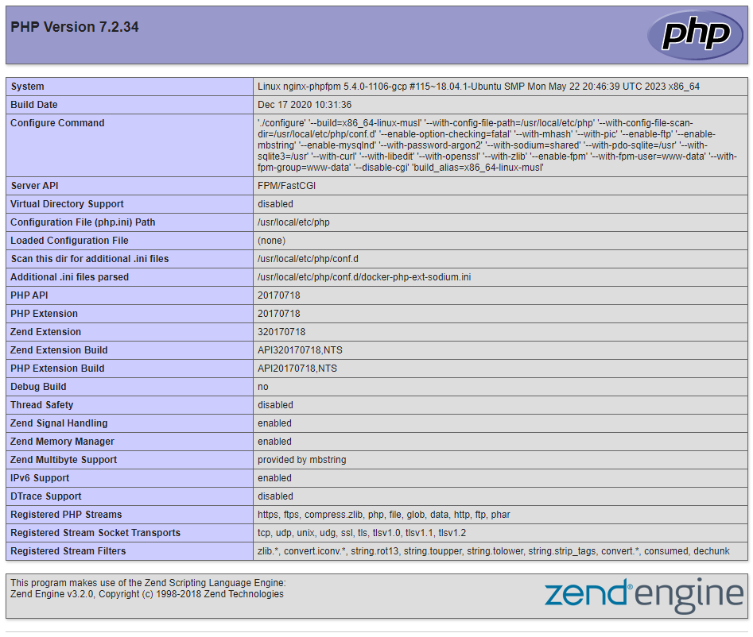

# Resolve Volume Mounts Issue in Kubernetes

Despite the title, the issue here is not entirely the volume mount itself, but also the content of the configmap which is being mounted. The site is not working because the nginx configuration in the configmap is incorrect.

1. Inspect the pod

    ```
    kubectl describe pod nginx-phpfpm
    ```

    Note the following

    * It has 2 containers - `php-fpm-container` and `nginx-container`.
    * Both containers share an emptyDir volume which is where the website files go.
    * `nginx-container` has an additional volume mounted from the config map which contains the config file for nginx.

1. What are the issues here?

    * Note that the two containers are mounting the shared volume at different paths.
    * Know that the default location for nginx site files is `/usr/share/nginx/html` not `/var/www/html` which is the default for Apache.

    The PHP container is assuming the nginx default path, but the nginx container is not.

1. Update the paths to all be `/usr/share/nginx/html`

    1. Edit the configmap

        ```
        kubectl edit configmap nginx-config
        ```

        Change the root path so it is like

        ```
        # Set nginx to serve files from the shared volume!
        root /usr/share/nginx/html;
        ```

    1. Update the pod to set the correct volume mount in the nginx container. Note that you cannot use `kubectl edit` to change pod properties as they are immutable.

        ```
        kubectl get pod nginx-phpfpm -o yaml > pod.yaml
        vi pod.yaml
        ```

        Update the volume mount in the nginx container

        ```yaml
          - image: nginx:latest
            imagePullPolicy: Always
            name: nginx-container
            resources: {}
            terminationMessagePath: /dev/termination-log
            terminationMessagePolicy: File
            volumeMounts:
            - mountPath: /usr/share/nginx/html    #<- Edit to be this
              name: shared-files
        ```

    1. Recreate the pod

        ```
        kubectl replace --force -f pod.yaml
        ```

        and check it is running, which it should be if you did not make a syntax error when editing

1. Copy the file into the nginx container at the webfiles path

    ```
    kubectl cp -c nginx-container index.php nginx-phpfpm:/usr/share/nginx/html/index.php
    ```

1. Test it by pressing the website button. You should see a page like this

    