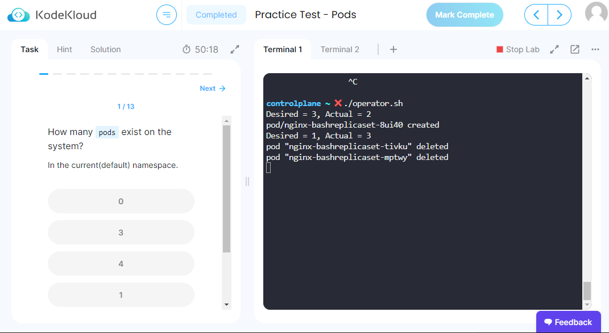

# What is an Operator in Kubernetes?

Basically, it is a workload usually running as a deployment just like all other workloads. More speficially its purpose is to do a job involved in maintaining desired state of the cluster. We can broadly categorize them as...

* Controller - These operators are responsible for managing cluster resources.
    * The kube-controller-manager is a collection of such operators all bundled into a single process and is responsible for nearly all the resources that are avaiaible by default in a kubernetes installation, e.g. `Deployment`, `ReplicaSet`, `StatefulSet`, `PersistentVolume` etc.
    * kubelet contains a controller that directly manages `Pod`
    * Custom Resource controllers have to be installed as a separate deployment along with the Custom Resource Definition(s) they will manage (more on this later).
* Installer - These operators are used to manage the installation of other software that itself has a complicated installation process, again via the use of Custom Resource Definitions. Prometheus is typically installed this way - when you `kubectl apply` a `Prometheus` resource manifest, then the operator will install and configure an instance of Prometheus automatically.

Note that for CKAD it is not necessary to know how to create an operator. You will only need to know what they are (above) and how they relate to Custom Resources. The course material on custom resources and custom resource definitions is sufficient.

## How do they work?

The software in the operator pods watch for changes to custom resources they manage. When they see a change (one is created, deleted or edited), then they act on the changes to bring the cluster to the state desired by the resource. For example, if you edit `replicas` of a deployment, the deployment controller sees this and updates the replica count in the manifest for the repliacset it controls. The replicaset controller responds to this change by creating or deleting pods as appropriate.

We can simulate how an operator works with a shell script running kubectl commands. A real operator is coded using the Kubernetes API for the programming language of the developer's choice and is doing exactly the same things - getting and applying resources. This script also demonstrates the extreme utility of JSONPath and thus why it is important to learn it.

We will deploy a custom resource definition for a new custom resource called `BashReplicaSet` which will look exactly like a normal replicaset in all but `kind`.

The shell script will act as the operator and will create or delete pods in response to changes to the number of `replicas`. It doesn't do everything that's expected of a real replicaset as that would get too complicated too quickly!

You can run the following in any of the Kubernetes labs or playgrounds.

1. Copy the [custom resource definition](./manifests/crd.yaml), paste to `vi` and save as a YAML file, e.g. `crd.yaml`
1. Deploy the CRD

    ```
    kubectl apply -f crd.yaml
    ```
1. Copy the [resource manifest](./manifests/replicaset.yaml) to `vi` and save it as a YAML file e.g. `resource.yaml`, then deploy with `kubectl apply`. The `BashReplicaSet` resource will be created, but nothing will happen yet, because the operator is not running.

    ```
    kubectl apply -f resource.yaml
    kubectl get BashReplicaSet
    kubectl get pods
    ```

    No pods - let's run the "operator"...

1. Copy the [operator script](./operator/operator.sh), paste into `vi` and save it as `operator.sh`
1. Run the operator script

    ```
    chmod +x operator.sh
    ./operator.sh
    ```

    You will now see pods being created. You need to leave the operator running, so open a second terminal window to do the next steps.

1. See the pods already created

    ```
    kubectl get pods
    ```

    If you get one of the pods that were just created with `-o yaml` and look in the metadata section, you'll see the pod name and the `ownerReference` section that were created by the operator. Refer to the comments in the [script](./operator/operator.sh) for why we have `ownerReference`.

1. Edit the resource. You can't use `kubectl scale` since that command only knows about the built-in deployment and replicaset.

    ```
    kubectl edit BashReplicaSet nginx-bashreplicaset
    ```

    Change the number of `replicas`

    Save and exit.

    Run

    ```
    kubectl get pods
    ```

    ...to see the number of running pods has now changed.

    Return to the first terminal and you will see output from the operator

Here is is running in a course lab environment...


