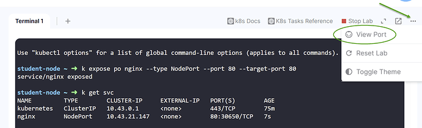

# Playground mini-FAQ

KodeKloud playgrounds are available to PRO subscribers and allow you to try things out in sandboxed playgrounds at no additional cost.

* [Why can't I?](#why-cant-i)
* [Cloud IAM](#cloud-iam)
    * [AWS IAM](#aws-iam)
* [Kubernetes Clusters](#kubernetes-clusters)
* [How do I browse my service?](#how-do-i-browse-my-service)

# Why can't I?

The majority of questions we handle on the forums are questions like "*Why can't I do X on this playground?*", normally in relation to the cloud playgrounds. These playgrounds have *limited* functionality and *restricted* access, i.e. it's not like you signed up for your own cloud account where you have full admin rights to do anything.

There are 3 main reasons

1. **Cost**. Many services are expensive to run. Also various configurations of services you are allowed to run like AWS EC2 where it's possible without constraints to launch a single instance that costs over 200 US dollars an hour! If we did not limit what can be done on a cost basis, the subscription price for PRO membership would have to be significantly increased!
1. **Security**. We need to protect against privilege escalations, e.g. ability to create new users with more permissions than the user you log in as, and unacceptable use of resources. Hence the IAM is quite tightly locked down. Tighter control on IAM also enforces the cost control described above, preventing users from launching costly resources.
1. **Manageability**. Adding a service that isn't currently offered in the playground is not a simple case of "just switch it on". We maintain a pool of cloud provider accounts which are recycled at the end of every session. For each supported service, there is a lot of work involved in:
    * Planning what parts of that service can be enabled from a cost point of view.
    * Security reviews on what we should permit to be done with that service, and that we do not leave open a privilege escalation door.
    * Creating the automation required to clean up all resources related to that service when your session ends.

    We are gradually increasing the number of offered services on each playground.

For each of the cloud playgrounds, the start page lists the services available and constraints on each. Read the entire page, don't just press the Launch Now button at the top. Pay particular attention to what it says there, including any service limitations where you will see a `View Limits` link. What you can do should include anything that covered by labs in any of our cloud courses, and a bit more.

Bottom line - if it's not listed, you can't launch it!

* AWS - https://kodekloud.com/cloud-playgrounds/aws
* Azure - https://kodekloud.com/cloud-playgrounds/azure
* GCP - https://kodekloud.com/cloud-playgrounds/google

## Cloud IAM

When you first log into a playground, you start with an initial user, usually something like `kk_labs_user_XX`. This has a set of permissions. In the playgrounds where you can create additional IAM resources, those resources must have specific names and cannot be granted any higher privilege than the user you log in as.

### AWS IAM

* You can create `IAM::User` as long as the name starts with `iamuser_`
* You can create `IAM::Group` as long as the name starts with `iamgroup_`
* You can create `IAM:Role` with specific names. Must be one of
    * `lambda_execution_role`
    * `CodeDeployRole`
    * `EC2InstanceRole`
    * `CodePipelineServiceRole`
    * `eksClusterRole`

You cannot assign any IAM resource higher permissions than the user you first log in as. This would be a privilege escalation.

# Kubernetes Clusters

Also a popular topic on the forums is "*I tried to launch an EKS/AKS/GKE cluster, but I got this permission error*". The permission errors are for the reasons stated in the previous paragraph. We have curated cluster builds that will work on the playgrounds. See [here](https://github.com/kodekloudhub/certified-kubernetes-administrator-course/tree/master/managed-clusters).

Note that `eksctl` is not supported on AWS playgrounds as it asserts IAM permissions that are not granted.

Also don't try to use terraform, CloudFormation, ARM templates etc that you find elsewhere on the Internet as they will almost certainly not work, again due to IAM restrictions.

# How do I browse my service?

You have created a Kubernetes service in a Kube playground, or perhaps deployed nginx or apache in a Linux playground and you want to see this in your browser. How do you do this? For single node playgrounds this is straight forward. Simply note the port number your service is listening on and then use the `View Port` option:



In the dialog box that comes up, enter your port number and your browser will open a new tab on the service.

For multi-node playgrounds such as [Kubernetes Multi Cluster](https://kodekloud.com/playgrounds/playground-kubernetes-multi-cluster) there is a bit more work to do. The `View Port` functionality can only connect to the node that the lab begins on, normally something like `student-node`. The clusters are running on other nodes which you have to SSH to, and as such `View Port` doesn't know about these. Therefore what we need to do is to set up a low-level port forward from the student node to another node where your server workload or Kubernetes node port service is running

Here is a worked example (using the Kubernetes Multi Cluster playground)

1. Create a service in `cluster1`

    ```bash
    kubectl run nginx --image nginx
    kubectl expose pod nginx --type NodePort --port 80 --target-port 80
    kubectl get svc nginx   # to get the node port number
    ```
1. Open another lab terminal tab and in this new tab, do the following
    ```bash
    apt update
    apt install -y socat
    ```
1. Still in the Terminal 2 tab, start the forwarding to your service. In this case, the node port for my nginx service was `30650`
    ```bash
    socat TCP-LISTEN:30650,fork TCP:cluster1-controlplane:30650
    ```
    Leave this running here for as long as you want to be able to browse the service.
1. Start `View Port` as described above and enter the node port number. You should now see the nginx welcome page in your browser.
1. Switch back to Terminal 1 to continue working.


