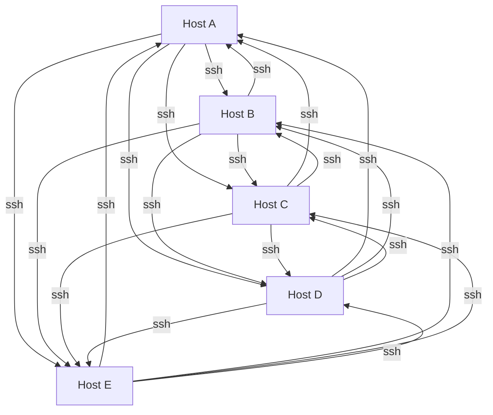
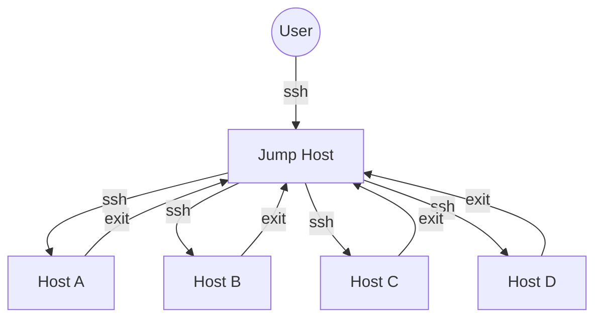

# SSH connections in a network of servers (hosts)

It is a common misconception of students and the cause of many questions on the forum that one should just keep using `ssh` to jump from host to host. For instance:

> In the lab, I did `ssh db` to get to DB server from web server. Now I try `ssh web` to return to web server and it is asking for password. What is the password?

It is asking for a password because `ssh` is not configured for that direction. The correct way to return to web server is to type `exit` which essentially reverses the `ssh` connection you made.

If you later try [KodeKloud Engineer](https://engineer.kodekloud.com/), there are many servers. The start server is called `jumphost`.  You always `ssh` to one server, `exit` back to `jumphost` then `ssh` to another server.

Why is it done this way? It is a security and operational best practice and is how it is done in the real world, not just labs. Every SSH connection requires a key pair, so if you could `ssh` from any host (server) to any other host in any direction on a network with `n` hosts, the number of key pairs that would have to be managed can be calculated using the formula `n(n-1)` which even with 10 servers on the network is 90 key pairs - per user who has access to all servers!

Jump hosts are often referred to as "bastion" servers. You will see this term come up in some of the other courses.

Let's look at this in pictures

## Spider's web SSH

With just 5 hosts here the number of possible SSH routes here using the formula is 20. Therefore to sustain this network I must update the `authorized_keys` file on every host with the public key of every other host, and if I add one more host, that is a lot of edits I have to do, as all the existing hosts now need to know about the new host! Consider when the network becomes 100 servers (not uncommon). That's now 9,900 edits!!

## Hub and spoke using a bastion

The number of routes is 4. You can use a single keypair with the public key copied to each of hosts A thru D, or to be more secure, 4 keypairs, one for each host. If I add one more server, then I only have to update the `authorized_keys` file on the new host.

## Terminology

If the concepts of ssh keys, bastions and `authorized_keys` are new to you, these are covered in other courses where management of SSH connections is covered such as [Linux Basics](https://learn.kodekloud.com/courses/learning-linux-basics-course-labs) and [LFCS](https://learn.kodekloud.com/courses/linux-foundation-certified-system-administrator-lfcs).
