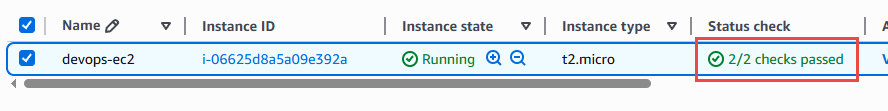
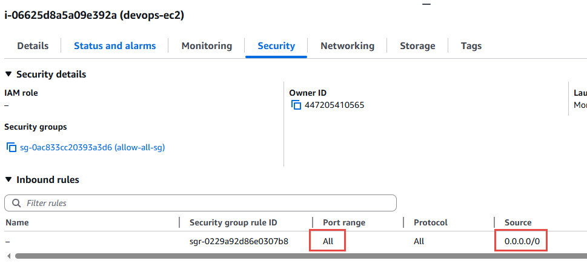
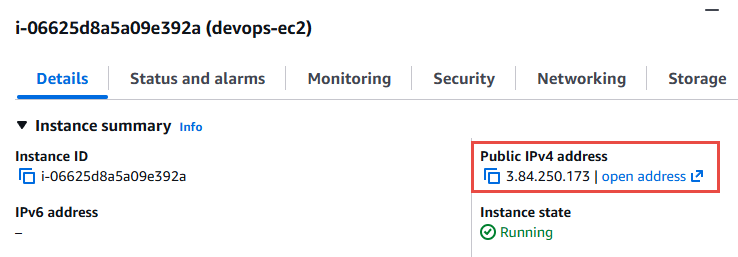
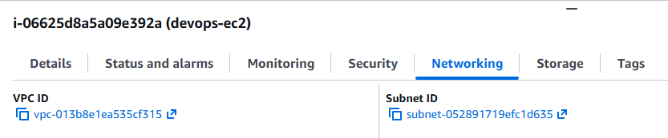
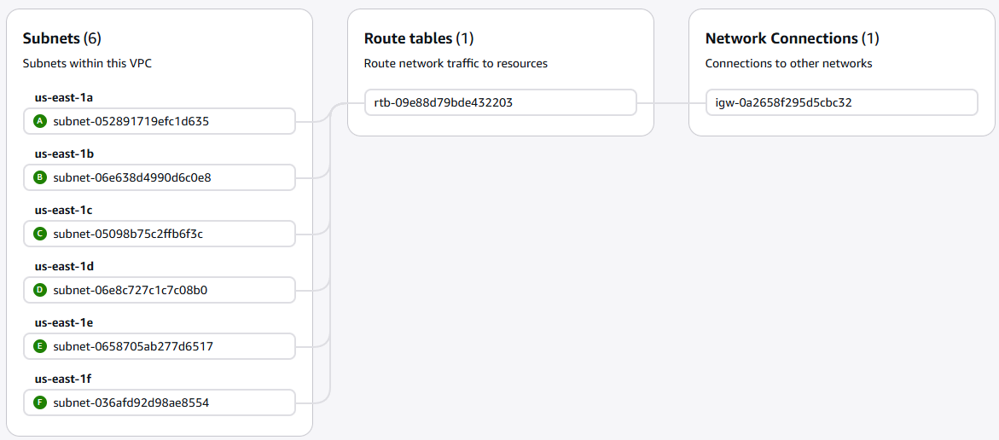
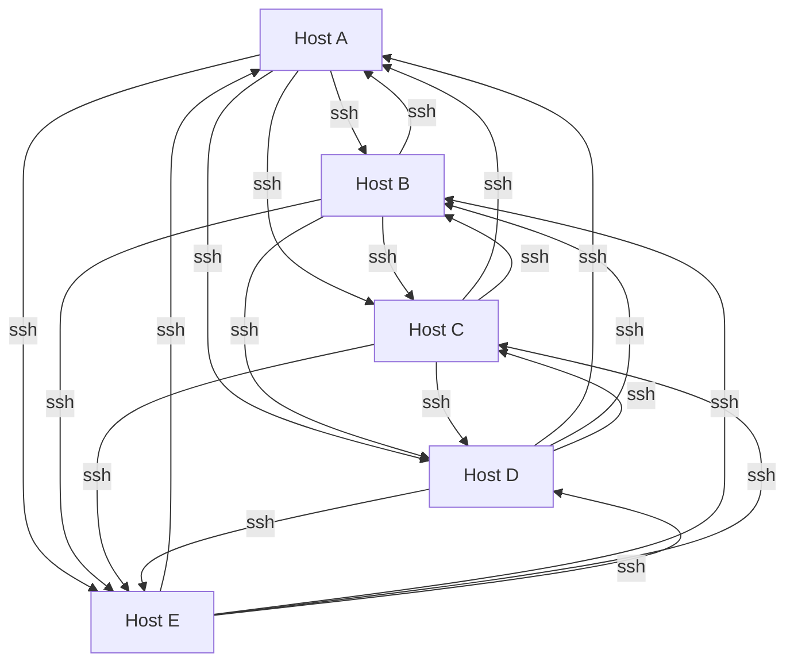
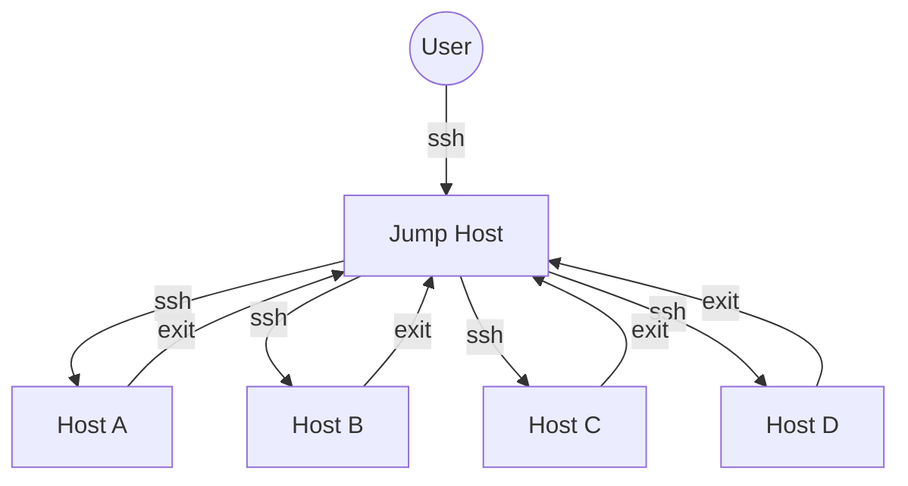

# SSH mini-FAQ

* [Debugging connection to AWS EC2 instances](#debugging-connection-to-aws-ec2-instances)
* [SSH connections in a network of servers (hosts)](#ssh-connections-in-a-network-of-servers-hosts)

## Debugging connection to AWS EC2 instances

Students often have issues connecting to EC2 instances from labs or KKE/100 days tasks. This section will go through what is needed to connect.

### Connecting from AWS console

Often to begin a task, you will need to connect directly from the AWS console first. This may be to insert an SSH public key that you have created using `ssh-keygen` in the lab console. There are a few things that must be correctly lined up to be able to do this.

1. The instance should be *fully* started. Check the `Status` column in the EC2 console and ensure it is `2/2 checks passed`. Wait until this is the case.
    
1. The instance *must* have a security group that allows inbound access from `0.0.0.0/0` on *at least* port 22, or `All` will do (less secure, but will work),
    
1. The instance *must* have a Public IP
    
1. The subnet it is connected to *must* have a route to the Internet Gateway.
    1. Click the small squares next to `VPC ID` and `Subnet ID` to copy values, paste these to your notepad
        
    1. Go to VPC console
    1. Select the VPC with the ID you copied (in nearly all labs there is only one VPC)
    1. Check the VPC `Resource Map`. It looks like this
        
    1. Verify that the subnet ID you coped is in the list on the left and that you can trace a line through `Route tables` to `Network connections` and that the network connection begins with `igw`, which indicates the Internet Gateway.

If all the above is true, then you can connect to the instance using EC2 Instance Connect.

For some KKE tasks you have to create a VPC. *You* have to ensure as part of that task if instances within the new VPC are to be able to be contacted from the lab terminal that all the above is set up when you create the VPC, subnet and route table.

### Connecting from lab terminal

Everything in the above section must be true to ensure SSH access from the outside world will work. Connection from the lab terminal will either be
* Via SSH key pair which you created from the AWS console, in which case that will have downloaded a PEM file either to you laptop (open the file, and paste the content to a new file *on the lab terminal*)
* Via ssh keys you created using `ssh-keygen` on the lab terminal. When using this method, ALWAYS accept the defaults for the key names (`id_rsa`) unless the question specifically says otherwise, else the grader will fail you.

When you use `ssh-keygen`, you must copy the content of the created `id_rsa.pub` to the EC2 instance's `authorized_keys` file as directed by the question. You will use EC2 Instance Connect to make the initial connection to EC2 to perform the copy.

## SSH connections in a network of servers (hosts)

It is a common misconception of students and the cause of many questions on the forum that one should just keep using `ssh` to jump from host to host. For instance:

> In the lab, I did `ssh db` to get to DB server from web server. Now I try `ssh web` to return to web server and it is asking for password. What is the password?

It is asking for a password because `ssh` is not configured for that direction. The correct way to return to web server is to type `exit` which essentially reverses the `ssh` connection you made.

If you later try [KodeKloud Engineer](https://engineer.kodekloud.com/), there are many servers. The start server is called `jumphost`.  You always `ssh` to one server, `exit` back to `jumphost` then `ssh` to another server.

Why is it done this way? It is a security and operational best practice and is how it is done in the real world, not just labs. Every SSH connection requires a key pair, so if you could `ssh` from any host (server) to any other host in any direction on a network with `n` hosts, the number of key pairs that would have to be managed can be calculated using the formula `n(n-1)` which even with 10 servers on the network is 90 key pairs - per user who has access to all servers!

Jump hosts are often referred to as "bastion" servers. You will see this term come up in some of the other courses.

Let's look at this in pictures

### Spider's web SSH

With just 5 hosts here the number of possible SSH routes here using the formula is 20. Therefore to sustain this network I must update the `authorized_keys` file on every host with the public key of every other host, and if I add one more host, that is a lot of edits I have to do, as all the existing hosts now need to know the public key of the new host and the new host needs all the public keys of the existing hosts! Consider when the network becomes 100 servers (not uncommon). That's now 9,900 edits!!

```mermaid
flowchart TD

    A[Host A]
    B[Host B]
    C[Host C]
    D[Host D]
    E[Host E]

    A -->|ssh| B
    A -->|ssh| C
    A -->|ssh| D
    A -->|ssh| E

    B -->|ssh| A
    B -->|ssh| C
    B -->|ssh| D
    B -->|ssh| E

    C -->|ssh| A
    C -->|ssh| B
    C -->|ssh| D
    C -->|ssh| E

    D -->|ssh| A
    D -->|ssh| B
    D -->|ssh| C
    D -->|ssh| E

    E -->|ssh| A
    E -->|ssh| B
    E -->|ssh| C
    E -->|ssh| D

```

### Hub and spoke using a bastion

The number of routes is 4. You can use a single keypair with the public key copied to each of hosts A thru D, or to be more secure, 4 keypairs, one for each host. If I add one more server, then I only have to update the `authorized_keys` file on the new host to add the public key for `jump host`.

```mermaid
flowchart TD

    User((User))

    Jump[Jump Host]

    A[Host A]
    B[Host B]
    C[Host C]
    D[Host D]

    User -->|ssh| Jump

    Jump -->|ssh| A
    Jump -->|ssh| B
    Jump -->|ssh| C
    Jump -->|ssh| D

    A -->|exit| Jump
    B -->|exit| Jump
    C -->|exit| Jump
    D -->|exit| Jump

```

## Terminology

If the concepts of ssh keys, bastions and `authorized_keys` are new to you, these are covered in other courses where management of SSH connections is covered such as [Linux Basics](https://learn.kodekloud.com/courses/learning-linux-basics-course-labs) and [LFCS](https://learn.kodekloud.com/courses/linux-foundation-certified-system-administrator-lfcs).
