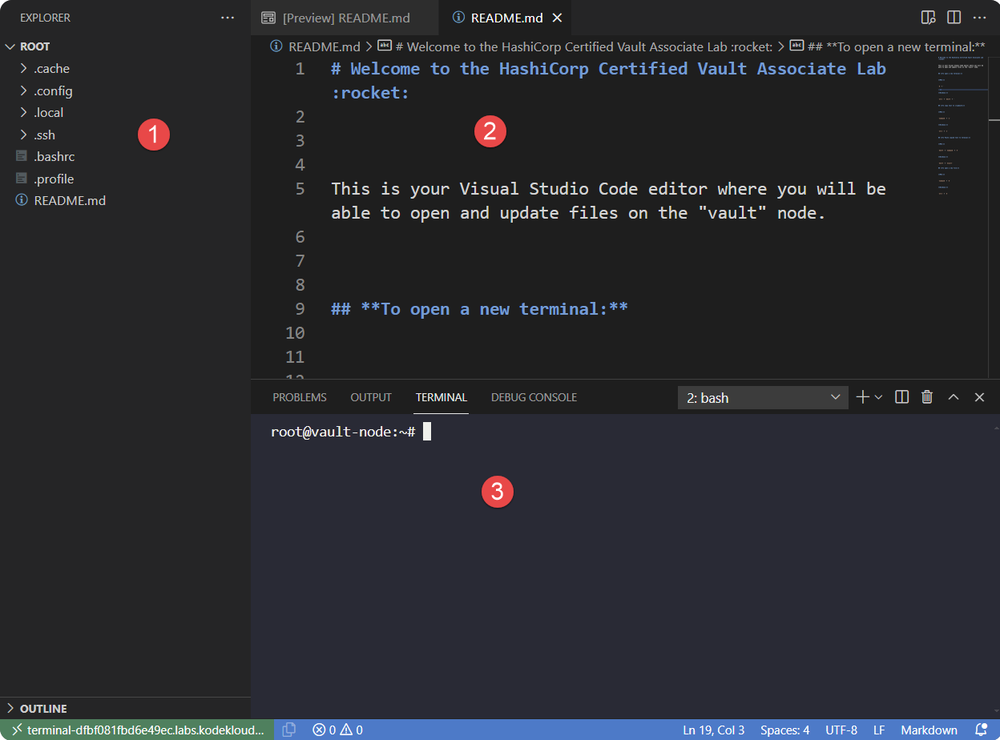
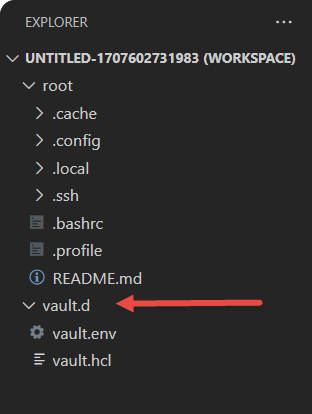

# VSCode Integrated Editor

Most of the terraform labs and some others use a VSCode editor embedded in the browser for coding exercises. Opening the terminal and getting copy and paste to work can be a challenge!

This page sets out how to solve this issue. It will be expanded as information about other browsers and operating systems is gathered, however as with all labs, the recommended browser is Chrome.

* [VSCode Lab Terminal](#vscode-lab-terminal)
* [Chrome Settings](#chrome-settings)
* [Open Terminal](#open-terminal)
* [Copy/Paste to Terminal](#copypaste-to-terminal)
* [The terminal I had open closed on me!](#the-terminal-i-had-open-closed-on-me)
* [How to add folders to the workspace](#how-to-add-folders-to-the-workspace)

## VSCode Lab Terminal

This is the layout of the terminal for labs that use VSCode

1. Explorer pane
1. Editor Pane
1. Integrated terminal. If this is not showing, see [Open Terminal](#open-terminal) below.

## Chrome Settings

Firstly, you must ensure that `kodekloud.com` and all subdomains have access to the clipboard.

1. Open `Settings`
1. Navigate to `Privacy and Security` from the menu on the left
1. Click on `Site Settings`
1. Under `Permissions` (Location, Camera etc.), click on `Additional Permissions`
1. Find `Clipboard`
1. In the `Allowed to see your clipboard` section, press `Add` button
1. Enter `[*.]kodekloud.com` in the Add dialog, and press `Add` button.

This much should permit you to copy and paste in the code editor windows.

## Open Terminal

On any system, the terminal my be opened from the Command Palette (normally `CTRL + SHIFT + P`). If that key combination doesn't work, right click on the editor window and Command Palette should be a selection on there.

In the command palette that opens at the top, start typing `Terminal: Create New Integrated Terminal` - you should see it appear in the drop down long before you complete typing the above command. Select it from there

To open a new terminal using shortcut keys, press:

### Mac

``CTRL + ` ``

### Windows

``CTRL + SHIFT + ` ``

Or

`CTRL + SHIFT + '`

## Copy/Paste to Terminal
To copy/paste to the integrated terminal window, we must use shortcut keys. If you try to use the mouse, you will see `Unable to read from the browser's clipboard` error.

### Windows

* **Copy** - `CTRL + C`
* **Paste** - `SHIFT + INSERT`

### Mac

* **Copy** - `COMMAND + C`
* **Paste** - `COMMAND + SHIFT + V`

### Linux

This requires further validation and is based on the input of one person who reports the following:

Open the lab in a new browser window, then `CTRL + C` and `CTRL + V` should work in the terminal.

Please post in Slack on your own experiences with using VSCode labs in Linux OS.

## The terminal I had open closed on me!

This happens, often after a "Setting things up..." between questions. Simply open it again with the key sequence above, then check the list of existing terminals in the list indicated in the screenshot below. Click on each of these till you recover the terminal you want.

Note that if you are using a small monitor, or you have narrowed the width of your browser, then the list of terminals at the side may instead appear as a drop list above the integrated terminal.

## How to add folders to the workspace

In some courses e.g. the Hashicorp Vault Associate, you will need to edit files in directories other than `/root`. You could do this by running `vi` in the VSCode terminal window, but it's nicer to be able to use VSCode.

Using the Vault course as an example where it's necessary to edit files in the directory `/etc/vault.d`, here is how to set that up...

1. Right click in the Explorer pane.
1. Select `Add Folder to Workspace...` from the menu. This will open a drop-down list showing the file system.
1. In the editor box above this list, enter the folder e.g. `/etc/vault.d` in the box and press the blue OK button. After a couple of seconds it will reload and you should see the additional folder in the explorer pane.

Note that when you [open the integrated terminal](#open-terminal) after adding folders, it will ask you which of these folders to open the terminal on. You should select the one that was there at the beginning (ususally `root`).

[Return to main FAQ](../README.md)