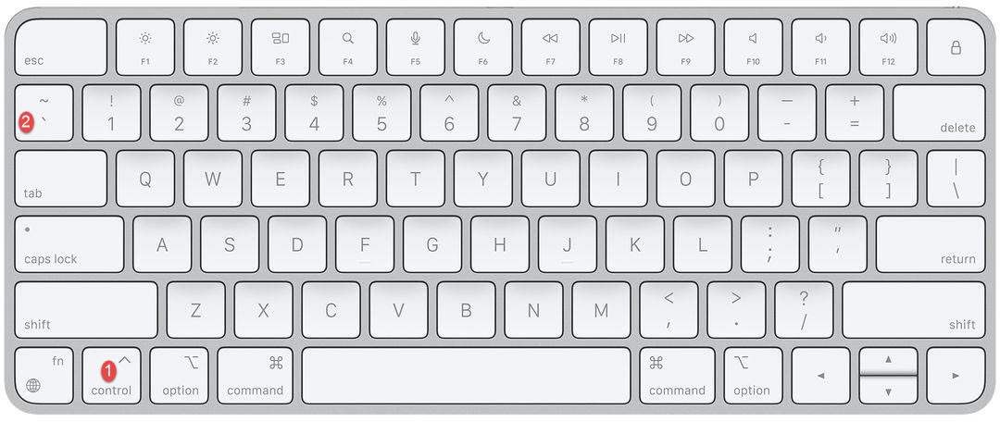
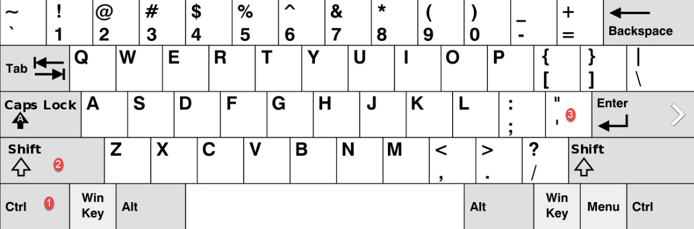
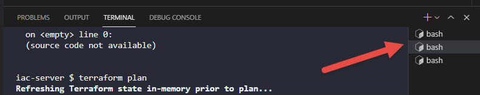

# VSCode Integrated Editor

Most of the terraform labs and some others use a VSCode editor embedded in the browser for coding exercises. Opening the terminal and getting copy and paste to work can be a challenge!

This page sets out how to solve this issue. It will be expanded as information about other browsers and operating systems is gathered, however as with all labs, the recommended browser is Chrome.

* [Chrome Settings](#chrome-settings)
* [Open Terminal](#open-terminal)
* [Copy/Paste to Terminal](#copypaste-to-terminal)
* [The terminal I had open closed on me!](#the-terminal-i-had-open-closed-on-me)

Firstly, you must ensure that `kodekloud.com` and all subdomains have access to the clipboard.

## Chrome Settings

1. Open `Settings`
1. Navigate to `Privacy and Security` from the menu on the left
1. Click on `Site Settings`
1. Under `Permissions` (Location, Camera etc.), click on `Additional Permissions`
1. Find `Clipboard`
1. In the `Allowed to see your clipboard` section, press `Add` button
1. Enter `[*.]kodekloud.com` in the Add dialog, and press `Add` button.

This much should permit you to copy and paste in the code editor windows.

## Open Terminal

To open a new terminal Press:

### Mac

``CTRL + ` ``

### Windows

``CTRL + SHIFT + ` ``

Or

`CTRL + SHIFT + '`

## Copy/Paste to Terminal
To copy/paste to the integrated terminal window, we must use shortcut keys. If you try to use the mouse, you will see `Unable to read from the browser's clipboard` error.

### Windows

* **Copy** - `CTRL + C`
* **Paste** - `SHIFT + INSERT`

### Mac

* **Copy** - `COMMAND + C`
* **Paste** - `COMMAND + SHIFT + V`

## The terminal I had open closed on me!

This happens, often after a "Setting things up..." between questions. Simply open it again with the key sequence above, then check the list of existing terminals in the list indicated in the screenshot below. Click on each of these till you recover the terminal you want.

[Return to main FAQ](../README.md)